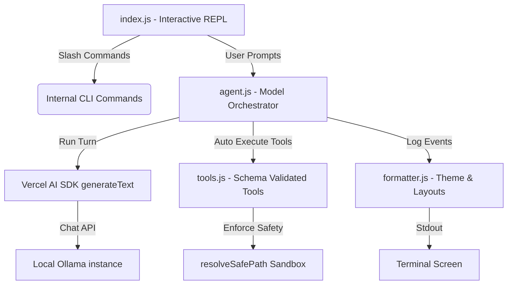

# 📄 Technical Specification: Multi-Mode Ollama CLI Agent Chat

This document contains the official technical specification, architecture, safety policies, and system designs for the **Multi-Mode Ollama CLI Agent Chat** project.

---

## 🧭 1. Executive Summary & Design Goals

The **Multi-Mode Ollama CLI Agent Chat** is a high-end, terminal-based AI Agent built in modern JavaScript (ESM) that operates 100% locally. By utilizing local **Ollama** models and the **Vercel AI SDK (v6)**, it equips the user with an intelligent terminal interface capable of proactive system/workspace tool execution, file manipulation, and math calculation within a secure sandbox environment.

### 🌟 Core Objectives
1. **Offline First**: Zero reliance on external API keys or cloud connections.
2. **Dynamic Multi-Functional Profiles**: Instant switching between diverse agent modes (balanced, code, system operations, and creative brainstorming).
3. **Interactive Model Discovery**: Dynamically queries the local Ollama instance on startup, letting the user choose from installed models.
4. **Visual & Aesthetic Excellence**: A gorgeous command-line user experience utilizing stylized color indicators, explicit step-by-step thinking processes, and structured tool blocks.
5. **Strict Security Boundaries**: An embedded sandbox resolving paths relative to the active workspace to prevent path traversal vulnerability.

---

## 🛠️ 2. High-Level Architecture

The project is structured with strict modularity, keeping concern separation distinct across entry points, model orchestrators, schema-validated tools, and visual formatters:



### Module Responsibilities

| File | Type | Primary Role | Key APIs Used |
| :--- | :--- | :--- | :--- |
| **`index.js`** | Entry Point | Drives the command loop, queries Ollama on startup for model selection, manages session history state, routes slash commands, handles graceful SIGINT exit. | `readline/promises`, `process` |
| **`agent.js`** | Orchestrator | Configures OpenAI-compatible Ollama provider, lists model registry, defines chat modes, executes manual turn-by-turn loops up to 5 steps, wraps raw tools with logger hooks. | `ai` (`generateText`), `@ai-sdk/openai`, `fetch` |
| **`tools.js`** | Logic / Tools | Defines schemas and execution logic for the 7 system and workspace tools. Implements safe path resolution. | `zod`, `fs/promises`, `path`, `os`, `fetch` |
| **`formatter.js`** | Presentation | Formats welcome banners, command sheets, tool call logs, tool results, selection menus, status indicators, and the model's `<thinking>` process. | `picocolors` |

---

## ⚡ 3. Dynamic Configuration & Connection

### 3.1. Ollama Model Discovery
On launch, the application polls Ollama's local tags registry (`GET http://localhost:11434/api/tags`) to find installed models.
*   **Single Model Found**: Automatically binds to it and launches the prompt.
*   **Multiple Models Found**: Presents a beautiful numeric menu letting the user select their model.
*   **Zero Models Found**: Guides the user to run `ollama pull` and accepts a manual name input as a fallback.
*   **Ollama Offline**: Warns the user that Ollama is unreachable, presenting option to retry connection or type a model manually.

### 3.2. Multi-Functional Chat Modes
The agent provides four specialized modes, each fine-tuned via prompt engineering and parameter presets (such as temperature):

| Mode Key | Emoji | Mode Name | Temperature | System Instruction Focus |
| :--- | :--- | :--- | :--- | :--- |
| **`balanced`** | 💬 | Balanced Assistant | `0.7` | General conversational helpfulness, standard planning, workspace file operations, and system queries. |
| **`code`** | 💻 | Code Specialist | `0.2` | Advanced software engineering, systems design, refactoring, formatting code blocks, and writing documentation. |
| **`system`** | ⚙️ | System Operator | `0.1` | Ultra-concise, dense information mapping, math operations, and presenting metrics in structured Markdown tables. |
| **`creative`** | 🧠 | Creative Planner | `0.9` | High-temperature brainstorming, lateral thinking, copy suggestions, and exploring conceptual options. |

### 3.3. Manual Multi-Step Orchestration
Standard AI SDK multi-step execution (`generateText` with `maxSteps`) often experiences instability or premature termination when interfacing with local model instances.
*   **Implementation Strategy**: A turn-based state machine runs an explicit loop:
    1. Send user message and chat history with dynamic `systemPrompt` and `temperature`.
    2. Check the response for `toolCalls`.
    3. If tool calls exist, execute them and record results, append results to history, and increment step counter.
    4. Repeat up to a safety threshold of **5 steps**.
    5. If no tool calls exist, capture the final response text and return the current conversation diff.

---

## 🔒 4. Workspace Safety Sandbox

All workspace tools must be prevented from reading, writing, or listing files outside the project's root folder (`process.cwd()`). Path traversal attacks (using `..` or absolute paths targeting system roots) are completely mitigated.

### Safe Path Engine (`resolveSafePath`)
Every file-system tool invokes `resolveSafePath` prior to carrying out any operations.

```javascript
const WORKSPACE_DIR = process.cwd();

function resolveSafePath(relativeOrAbsolutePath) {
  const resolved = path.resolve(WORKSPACE_DIR, relativeOrAbsolutePath);
  if (!resolved.startsWith(WORKSPACE_DIR)) {
    throw new Error('Access denied: Action not permitted outside workspace directory.');
  }
  return resolved;
}
```

> [!CAUTION]
> If any path fails this verification, the action is immediately blocked with an `Access denied` exception, preventing reading, writing, or traversing sensitive host operating system folders.

---

## 🛠️ 5. Integrated Workspace & System Tools

The agent is equipped with **7 tools** that are structured using **Zod schemas**:

### 1. `calculator`
*   **Description**: Safe math evaluation.
*   **Schema**: `{ expression: z.string() }`
*   **Safety Implementation**: Rejects anything containing characters outside `[0-9+\-*/%().\s]`. Rejects arbitrary JS payload injection before calling the dynamic evaluator.

### 2. `getSystemInfo`
*   **Description**: Live host resource usage and operating system overview.
*   **Schema**: `{}`
*   **Output Parameters**: Operating system platform/release, CPU architecture, host uptime, RAM metrics (total GB, used GB, free GB, percent used), and CPU hardware model.

### 3. `getCurrentTime`
*   **Description**: Real-time datetime parameters.
*   **Schema**: `{}`
*   **Output Parameters**: Local computer time, ISO standard time, millisecond timestamp, and UTC timezone offset in minutes.

### 4. `listFiles`
*   **Description**: Recursively maps workspace directory tree structure.
*   **Schema**: `{ directory: z.string().optional() }` (defaults to `"."`)
*   **Safety & Performance**: Bounded by `resolveSafePath`. Automatically filters out noise directories and giant files like `node_modules`, `.git`, `.antigravitycli`, `.gemini`, and `package-lock.json` to keep contexts fast and highly readable.

### 5. `readFile`
*   **Description**: Reads plain-text files.
*   **Schema**: `{ filePath: z.string() }`
*   **Safety & Performance**: Checked by `resolveSafePath`. Automatically truncates files longer than **10,000 characters** to protect LLM context length limit.

### 6. `writeFile`
*   **Description**: Writes and overwrites workspace plain-text files.
*   **Schema**: `{ filePath: z.string(), content: z.string() }`
*   **Safety & Performance**: Checked by `resolveSafePath`. Automatically maps and creates the parent subdirectory recursively if it does not already exist.

### 7. `fetchWebPage`
*   **Description**: Fetches textual content of public web URLs or REST APIs.
*   **Schema**: `{ url: z.string().url() }`
*   **Safety & Performance**: Includes an automatic **8-second timeout** via `AbortController`. Automatically parses JSON formatting. For HTML responses, it strips out useless `<script>` tags, `<style>` definitions, and converts HTML to plain text, truncating outputs exceeding **5,000 characters**.

---

## 🎨 6. Visual Theme & Command Interfaces

The terminal UX uses stylized outputs, distinct layouts, and real-time reasoning observability:

### 6.1. Interactive Terminal Slash Commands
While prompting the CLI, users have access to dynamic in-session commands:

| Command | Action Executed |
| :--- | :--- |
| **`/help`** | Displays general usage instructions and describes CLI commands. |
| **`/mode`** | Lists available modes and prompts the user to select. |
| **`/mode <name>`** | Instantly switches active chat mode (e.g. `/mode code` or `/mode system`). |
| **`/model`** | Lists available models in the local Ollama instance and prompts for selection. |
| **`/tools`** | Lists names and summaries of the 7 workspace tools actively loaded. |
| **`/info`** | Shows active session diagnostics (active model, active mode, workspace root, message history count). |
| **`/clear`** | Clears the command screen and clears the memory history array. |
| **`/exit`** or **`/quit`** | Gracefully disconnects file interfaces and exits with `process.exit(0)`. |

### 6.2. Thinking Observability
Local models like Gemma 4 produce a `<thinking>...</thinking>` block containing inner thought process logic.
*   **Design**: In `formatter.js`, the `<thinking>` logs are parsed and formatted using `picocolors.dim(picocolors.italic("  ..."))` nested under a cyan header. This gives a beautiful terminal presentation showing the model's exact "train of thought".

### 6.3. Color Theme Specifications
Visual components are rendered using consistent colors via `picocolors`:
*   🟢 **User Prompts (`You › `)**: Bold Green.
*   🟣 **Agent Headers (`🤖 <Mode> › `)**: Bold Magenta.
*   🟡 **Tool Actions**: Bold Yellow indicators to track execution.
*   🔵 **Tool Result Metadata**: Bold Blue.
*   🔴 **System Warnings & Errors**: Bold Red.
