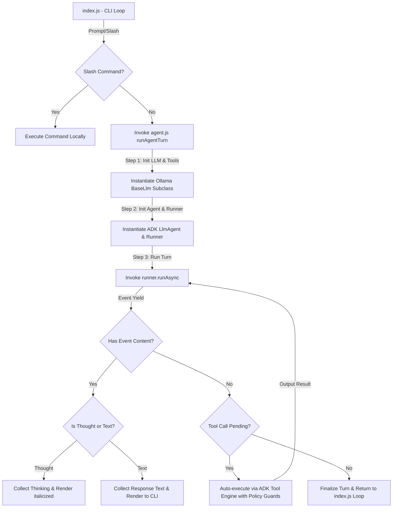

# 🏛️ System Architecture

The **plumar-cli** (Plumar) is engineered with an emphasis on high modularity, security sandboxing, and runtime orchestration stability. This document outlines the system architecture, component relationships, security measures, and the custom execution model.

---

## 📐 1. Component Modularity

The codebase is split into discrete modules, each maintaining a clear separation of concerns, keeping the workspace root clean and lightweight:

```
/home/nandrade/localmodel/
├── index.js                  # Entry-point, drives terminal REPL, processes slash commands, restores history
└── src/                      # Core application source folder
    ├── agent.js              # ADK model provider (Ollama LLM class) & ADK Runner orchestration
    ├── tools.js              # 35 schema-validated local tools utilizing @google/adk FunctionTool
    ├── formatter.js          # Theme-consistent layouts, banners, and CLI styling using picocolors
    ├── session-manager.js    # Sessions persistence, loading, and active prompt history management
    ├── reverse-search.js     # Interactive Ctrl+R reverse search implementation
    ├── skills-plugins-manager.js # Wizard coordinator for custom YAML skills and JS plugins
    ├── google-search-mcp.js  # Built-in Google search Model Context Protocol (MCP) server
    ├── mcp-client-manager.js # Connections manager and multiplexer for external MCP servers
    └── mcp.js                # Core local Model Context Protocol handling
```

### Module Flow & Control Layout



---

## 🔄 2. ADK-Driven Conversation & Tool Orchestration

Plumar relies on the official **Google Agent Development Kit (@google/adk)** to orchestrate LLM execution and tool invocation. 

Rather than standard third-party agent loop packages that can struggle with local model instability (e.g. timeouts or bad function calling), Plumar utilizes a custom subclass `Ollama` extending `BaseLlm` coupled with the standard ADK `LlmAgent` and `Runner`.

### How the Orchestration Loop Works:
1.  **Preparation**: On receiving a user prompt, `index.js` invokes `runAgentTurn()`. This retrieves active chat profile (Mode) parameters, loads custom skills system prompts, and sets the temperature.
2.  **Model Instantiation**: An `Ollama` instance is initialized with the selected local or remote model, host URL, and authentication headers.
3.  **Tool Wrapping**: The active 35 workspace tools are mapped and wrapped inside ADK's `FunctionTool` constructor.
4.  **Runner Execution**: An ADK `Runner` is spun up, binding the agent, active sessions, and file artifacts. Plumar calls `runner.runAsync` to feed the new message stream.
5.  **Streaming & Observability**:
    -   **Thinking Extraction**: Real-time thinking blocks generated by models (like Gemma 4's chain-of-thought) are intercepted and printed with elegant, dimmed, italicized CLI formats.
    -   **Response Capture**: Final responses are output progressively to the user.
6.  **Tool Execution**:
    -   If the model requests tool calls, ADK automatically executes them in-process, respecting the interactive **allow/ask/deny policies** defined by the user.
    -   Tool results are captured, stylized inside visual blocks, and dynamically fed back to the LLM to resume the turn asynchronously.

---

## 🔒 3. Workspace Path Safety Sandboxing

A critical vulnerability in developer agents is **directory traversal** (allowing models to read/write random files on the host computer via `..` or absolute path manipulation).

Plumar solves this completely with a **strict file sandbox engine** powered by `resolveSafePath` inside `./src/tools.js`:

```javascript
const WORKSPACE_DIR = process.cwd();

function resolveSafePath(relativeOrAbsolutePath) {
  if (!relativeOrAbsolutePath || typeof relativeOrAbsolutePath !== 'string') {
    throw new Error('Access denied: Provided path must be a non-empty string.');
  }
  const resolved = path.resolve(WORKSPACE_DIR, relativeOrAbsolutePath);
  if (!resolved.startsWith(WORKSPACE_DIR)) {
    throw new Error('Access denied: Action not permitted outside workspace directory.');
  }
  return resolved;
}
```

### Sandbox Protections:
-   **Path Resolution**: All filesystem-bound tools (`readFile`, `writeFile`, `appendFile`, `deleteFile`, `makeDirectory`, `searchReplace`, `searchGrep`, `findFiles`, `writeMarkdown`, `base64Convert`, `generateMockData`, `generateHash`) must call `resolveSafePath()` before executing any Node.js `fs` calls.
-   **Security Boundary Check**: The resolved absolute path is checked against the active workspace root (`process.cwd()`). If it does not start with the workspace root, an `Access denied` exception is thrown immediately.
-   **Model Resiliency**: If a tool throws an `Access denied` error, the error is safely returned to the LLM. The model is forced to recognize that its boundary was violated and must correct its path arguments accordingly, preventing crashes.

---

## 🛠️ 4. Tool Registry Architecture (`@google/adk`)

Each tool is constructed as a `FunctionTool` imported from `@google/adk`.
-   **Zod Schema Validation**: Tool schemas define exact types, required fields, and descriptive summaries. The orchestrator translates these schemas into OpenAI-compatible tool call JSON definitions automatically.
-   **Error Isolation**: Tool executors are wrapped in independent try-catch blocks. If a tool fails (due to a missing file or syntax error), it returns `{ success: false, error: error.message }` directly to the model, allowing the model to correct its logic on the next turn.
