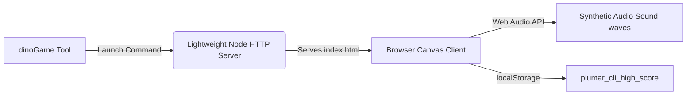

# 👾 plumar-cli Dino Game Guide

The plumar-cli is equipped with a custom-engineered, retro-synth, space-themed **plumar-cli Dino Game**. It can be launched directly from your terminal, running entirely on a local lightweight Node.js web server.

---

## ✨ 1. Key Features

- **Deep Space Neon Aesthetics**: Glowing geometric pixel-art style T-Rex, procedural moving ground blocks, and a parallax-scrolling starfield backdrop.
- **Client-Side Synthetic Sound FX**: Powered entirely by the browser's native **Web Audio API** (requires zero file assets to load). It generates nostalgic, retro 8-bit sound waves for jumps, gravity flips, score milestones, and collisions.
- **Dual Physics Modes**:
  - **Standard Gravity**: Classic jumping and ducking physics.
  - **Low-G Gliding**: Drastically reduced gravity allowing the Dino to smoothly glide through high-altitude barriers.
  - **Gravity Flipping**: Instantly invert gravity on-the-fly, allowing the Dino to run along the ceiling!
- **Persistent High-Score Tracking**: Tracks your current score and automatically records your personal high score persistently in your browser using `localStorage` under the key `plumar_cli_high_score`.

---

## 🕹️ 2. Game Controls

You can control the Dino using either your keyboard or touch/mouse clicks on the screen:

| Action | Keyboard Bind | Alternative / Mouse |
| :--- | :--- | :--- |
| **Jump / Glide Up** | `Space` or `↑ Arrow` | Click / Tap Screen |
| **Duck / Slam Down** | `↓ Arrow` | None |
| **Flip Gravity** | `Shift` or `F` | Double-Tap Screen / Custom UI Button |

---

## 🚀 3. Managing the Game Server

The agent is equipped with the `dinoGame` workspace tool to control the local game server.

You can ask the agent:
> *"Launch the Dino game for me"*

This will automatically invoke the tool under the hood, spin up the server, and open your default web browser to the game page.

### Manual Tool Invocation Actions:

- **`"start"`**: Starts the lightweight HTTP server on an available local port (defaulting to `3456`) and opens `http://localhost:3456` in your default browser.
- **`"status"`**: Checks if the server is currently running and retrieves its active host port and routing variables.
- **`"stop"`**: Shuts down the HTTP server process, closing all active socket connections gracefully.

---

## 📂 4. Project Assets & Locations

The game code is designed to be easily inspected or modified:
- **Game Page**: `dino-game/index.html` - Contains all frontend HTML, canvas render logic, gravity collision formulas, synth sound generators, and canvas animation frames.
- **Launcher Hook**: `src/tools.js` (inside `tools.dinoGame`) - Houses the Node.js HTTP file serving logic and automatic browser launcher.

Enjoy playing the game! Try flipping gravity when things get too fast!
