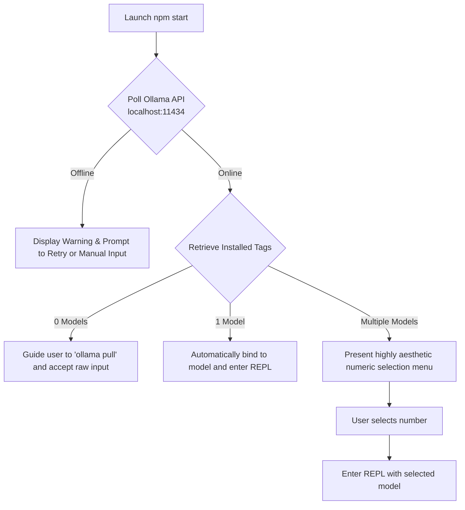

# 🚀 Getting Started

This guide walks you through setting up, configuring, and launching the **plumar-cli Agent Chat** (Plumar) application on your local machine.

---

## 📋 1. Prerequisites

Before starting, ensure you have the following installed on your system:

- **Node.js** (v18.0.0 or higher)
- **npm** (v9.0.0 or higher)
- **Ollama** (Runs local LLM models locally; make sure the Ollama daemon is running in the background)

---

## 📥 2. Pulling Your Preferred Local Model

Plumar is fully model-agnostic. While it runs beautifully with models like **Gemma 4 (8.0B)**, it is compatible with any local model supported by Ollama.

To pull a model locally, open your terminal and run:
```bash
ollama pull gemma4
```

> [!TIP]
> If you have other models installed (e.g., `llama3`, `qwen2.5`, `mistral`, `phi3`, etc.), Plumar is equipped with **Interactive Model Discovery** on startup. It will detect all of your local models and allow you to select your preferred one dynamically!

---

## 🛠️ 3. Installation

Clone or locate the workspace directory and install the necessary dependencies:

```bash
# Navigate to the workspace
cd /home/nandrade/localmodel

# Install Node dependencies
npm install
```

This installs core developer packages including:
- `@google/adk` - Forms the backbone of agent execution, session serialization, and tool integration.
- `zod` - Used for robust schema validations on all 35 tools.
- `picocolors` - Powering the high-end terminal theme.
- `jimp` - Powering advanced image manipulation tools.

---

## 🚀 4. Launching the Agent Chat

Start the interactive CLI session in your terminal:

```bash
npm start
```

### 💡 Enabling Verbose ADK Logging (Optional)
The agent utilizes `@google/adk` for its tool construction. Verbose internal logging/telemetry from ADK is disabled by default to keep the REPL output clean. You can enable it dynamically using startup flags, environment variables, or REPL slash commands:

*   **Option A: Startup Flags**
    ```bash
    npm start -- --adk-info
    # or
    npm start -- --enable-adk-info
    ```
*   **Option B: Environment Variables**
    ```bash
    ADK_INFO=true npm start
    ```
*   **Option C: Slash Command**
    Type `/adk-info` directly inside the REPL to toggle logging on-the-fly.

---

## 🔄 5. Startup Connection & Model Selection

When you run `npm start`, the application executes its **Connection Lifecycle**:



### Aesthetic Choice
If multiple models are found, you will be prompted with a beautiful terminal picker:
```
🔍 Checking local Ollama models...
Found 3 local models. Please select one:
  [1] gemma4:latest (Default)
  [2] llama3:8b
  [3] mistral:latest

Enter number [1-3]: 1
```

Once selected, a gorgeous welcoming banner will render, showing your active model, workspace safety path, and loaded tool count.

---

## 💬 6. Switching Conversation Profiles (Modes)

The agent operates in four distinct **Profiles** (Modes). Each profile adjusts model parameters (like temperature) and applies specific system instruction focuses:

| Mode | Command | Temp | Description / Focus |
| :--- | :--- | :--- | :--- |
| **Balanced** 💬 | `/mode balanced` | `0.7` | Default mode. Great for balanced coding, general assistance, and filesystem queries. |
| **Code Specialist** 💻 | `/mode code` | `0.2` | Low temperature for rigid syntax, software architecture, refactoring, and documentation. |
| **System Operator** ⚙️ | `/mode system` | `0.1` | Ultra-concise, analytical responses, multi-step operations, and markdown formatting. |
| **Creative Planner** 🧠 | `/mode creative` | `0.9` | High temperature for brainstorming, marketing copy, and open-ended conceptual solutions. |

To switch modes at any point in your chat session, simply type `/mode <name>` in the REPL (e.g. `/mode code`).
