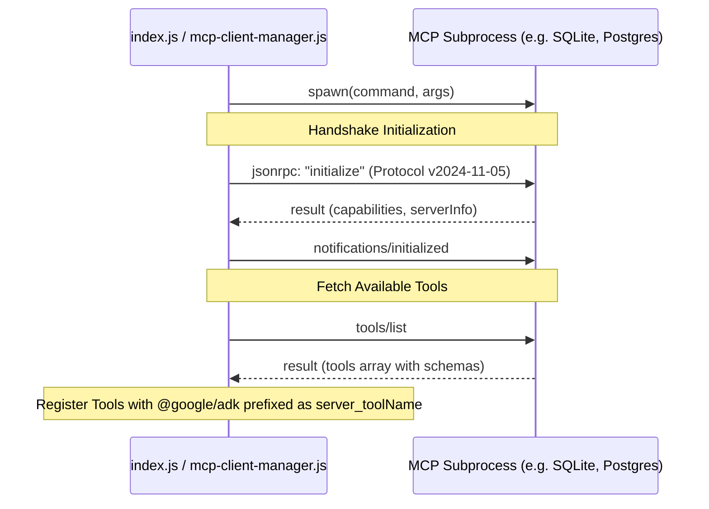

# 🔌 Model Context Protocol (MCP) Integration

The **plumar-cli** supports the open **Model Context Protocol (MCP)**, allowing you to dynamically extend the agent's toolset with external tools. 

On startup, the CLI automatically loads server definitions from `mcp-servers.json` in the workspace root, spawns their processes, handles JSON-RPC handshakes, and registers their tools with unique namespacing.

---

## 🏛️ How MCP Integration Works

The system implements a custom, robust JSON-RPC 2.0 client inside `src/mcp-client-manager.js`:



---

## 📁 1. The Configuration File (`mcp-servers.json`)

To add or manage servers, edit **`mcp-servers.json`** in your workspace root. Each server config supports:
*   `command`: Executable command name (e.g. `npx`, `python`, `node`, `docker`).
*   `args`: Array of command-line arguments.
*   `env`: Object mapping custom environment variables for the spawned process.
*   `disabled`: Set to `true` to skip connecting to a server without deleting its config.

### Configuration Template:
```json
{
  "mcpServers": {
    "sqlite": {
      "command": "npx",
      "args": [
        "-y",
        "@modelcontextprotocol/server-sqlite",
        "--db",
        "sqlite.db"
      ],
      "disabled": false
    },
    "custom-python-server": {
      "command": "python",
      "args": ["src/server.py"],
      "env": {
        "API_SECRET_KEY": "my_secret_token"
      },
      "disabled": false
    }
  }
}
```

---

## 🏷️ 2. Tool Namespacing (Prefix System)

To prevent name collisions between different servers or our 35 local tools, the client manager automatically prefixes tool names:
```
[Server Name]_[Raw Tool Name]
```

### Examples:
- If a server named `sqlite` exposes a tool called `query`, it will register as: **`sqlite_query`**.
- If a server named `mongodb` exposes a tool called `find-documents`, it will register as: **`mongodb_find-documents`**.

When entering a chat session, type `/tools` to verify your registered MCP tools. They will automatically be formatted with the visual label: `[MCP Server: <name>]`.

---

## 🚀 3. Step-by-Step Guide to Add an MCP Server

Let's walk through adding the official **SQLite MCP Server** to your workspace.

### Step 1: Edit `mcp-servers.json`
Open `/home/nandrade/localmodel/mcp-servers.json` and ensure `"disabled": false` is set for the SQLite entry:
```json
"sqlite": {
  "command": "npx",
  "args": [
    "-y",
    "@modelcontextprotocol/server-sqlite",
    "--db",
    "sqlite.db"
  ],
  "disabled": false
}
```

### Step 2: Restart the plumar-cli
Stop your active CLI session and run:
```bash
npm start
```

### Step 3: Observe Handshake Logs
On startup, you will see real-time handshake indicators printed directly to your console stderr:
```
🔌 Connecting to MCP Server "sqlite"...
✔ Connected to MCP Server "sqlite". Registered 5 tools.
```

### Step 4: Test in REPL
Type `/tools` in your chat prompt. You will see the newly integrated tools:
- `sqlite_query`
- `sqlite_describe_table`
- ...and others!

You can now ask the agent to interact with SQLite databases directly:
> *"Create a table called users and insert 3 rows."*

---

## 🔒 4. Safety & Error Handling

- **Independent STDERR Isolation**: The manager captures all `stderr` outputs from the MCP server subprocess and forwards them directly to the terminal, prefixed as `[MCP Log - <serverName>]`. This helps debug server-side database connection failures or missing dependencies.
- **Graceful Shutdown**: When you exit the CLI (using `/exit` or standard `SIGINT` / `Ctrl+C`), the process loop captures the termination signal, iterates through all connected clients, and invokes `.kill()` to ensure zero orphan processes are left running on the host system.
- **Payload Validation**: Arguments passed from the LLM are validated against the server's published `inputSchema` using `@google/adk`. If the parameters are misaligned, the local agent catches the schema error and refuses to send bad JSON payloads over the RPC pipe.
